# Практическая работа №1: Основы разработки под Android
---

Выполнил:

Быковников Тимофей Александрович

Группа: ИНС-б-о-24-1

## Цель работы:

Изучение интерфейса Android Studio и создание первого простого приложения.

## Ход работы
### 1. Установка и настройка Android Studio

Запуск установщика Android Studio прошёл успешно, установка была выполнена в обычном режиме.

  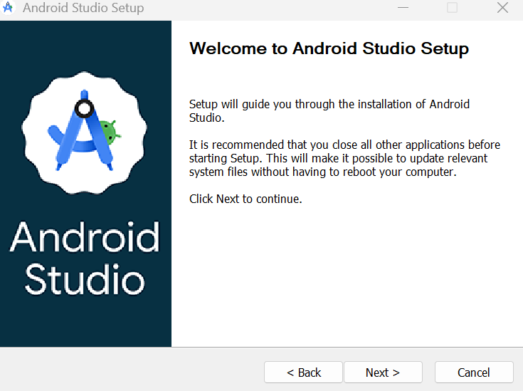
  
 Рисунок 1 — Инсталятор Android Studio 

  

### 2. Запуск Android Studio и создание приложения
Android Studio предоставляет несколько готовых шаблонов. Для создания самого простого приложения был выбран шаблон Empty Views Activity.

  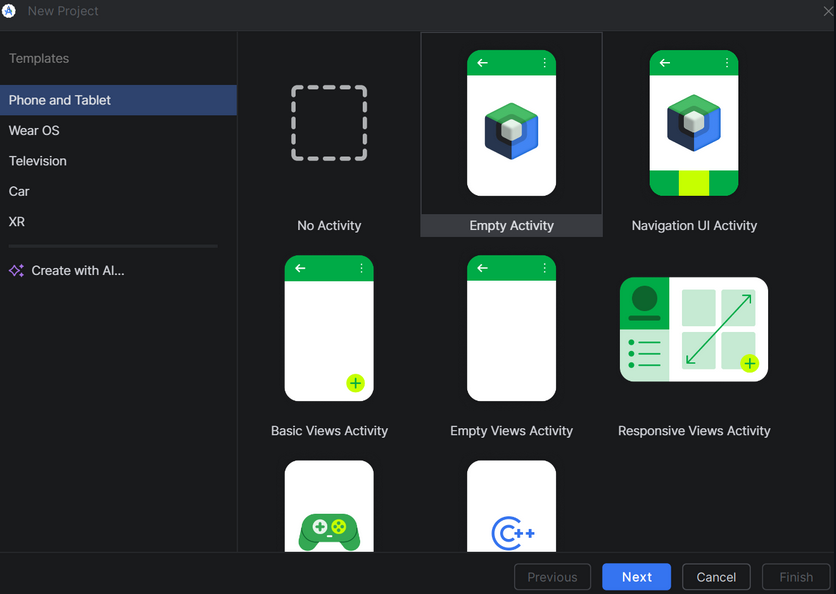
  
 Рисунок 2 — Выбор шаблона 

  

После нажатия «Next» был указан путь для сохранения проекта.

  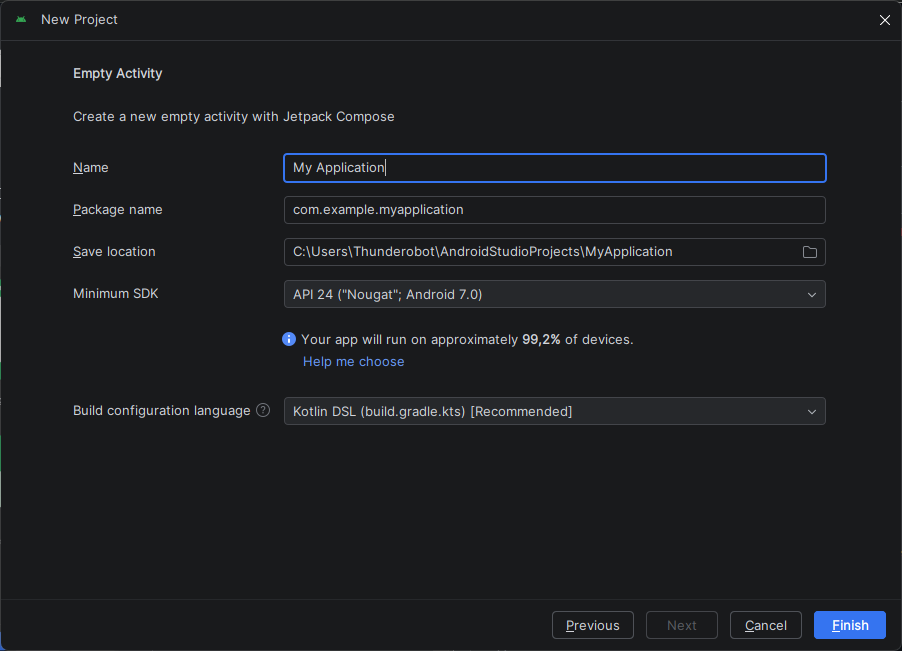
  
 Рисунок 3 — Выбор места создания проекта 

  

Открылось основное окно среды разработки.

  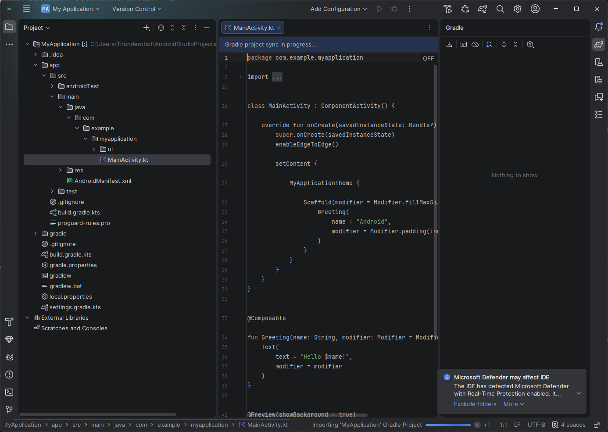
  
 Рисунок 4 — Главное окно приложения 

  
Для запуска приложения было создано виртуальное устройство (эмулятор).

  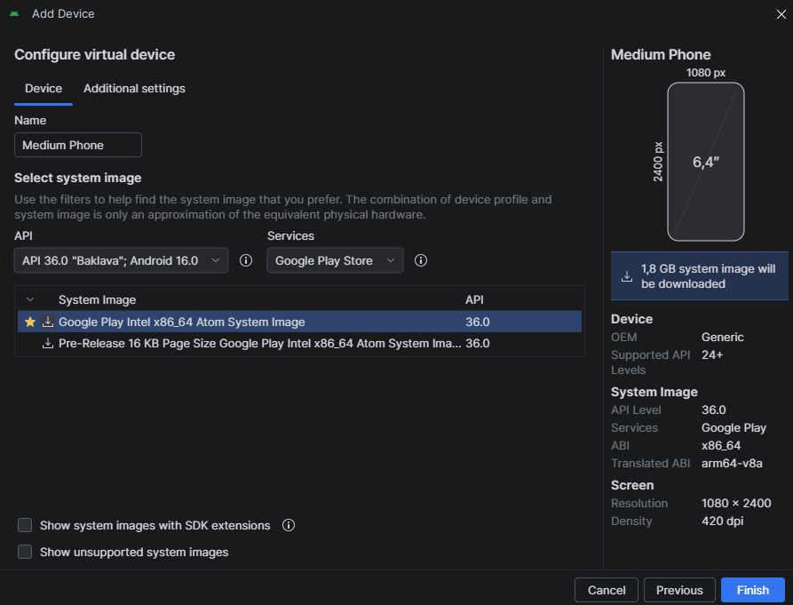
  
 Рисунок 5 — Создание виртуального устройства 

  

  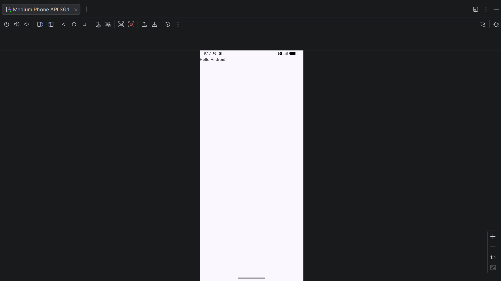
  
 Рисунок 6 — Главное окно эмулятора 

  
Интерфейс приложения создаётся с использованием языка XML. Файлы разметки имеют расширение `.xml`.

  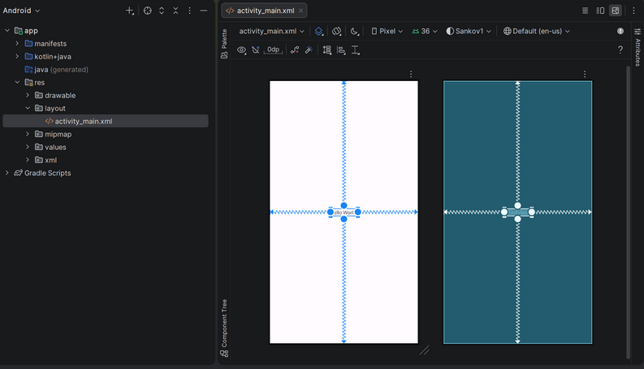
  
 Рисунок 7 — Интерфейс XML 

  
### 3. Изменение названия приложения
Название приложения можно изменить с помощью метода setTitle() в MainActivity.java.

  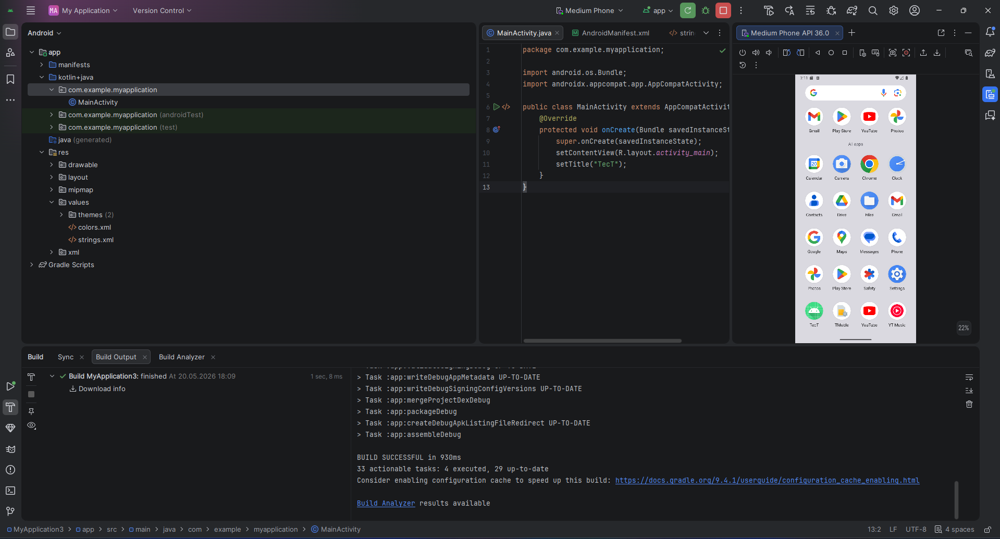
  
 Рисунок 8 — Изменение названия приложения 

  
### 4. Добавление элементов на страницу приложения
Для рисования графических примитивов был создан класс-конструктор DrawView.

  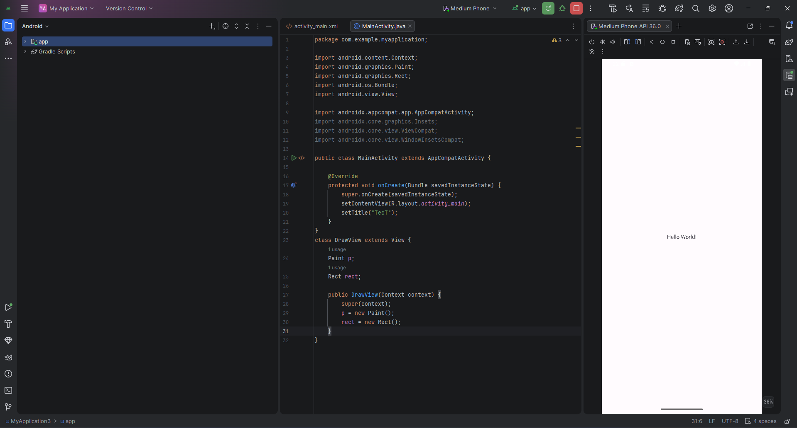
  
 Рисунок 9 — Создание класса DrawView 

  
Далее был создан «холст» (Canvas), на котором выполняется отрисовка. На холсте при помощи метода drawARGB() задаём цвет фона. Также добавляем красный прямоугольник:

  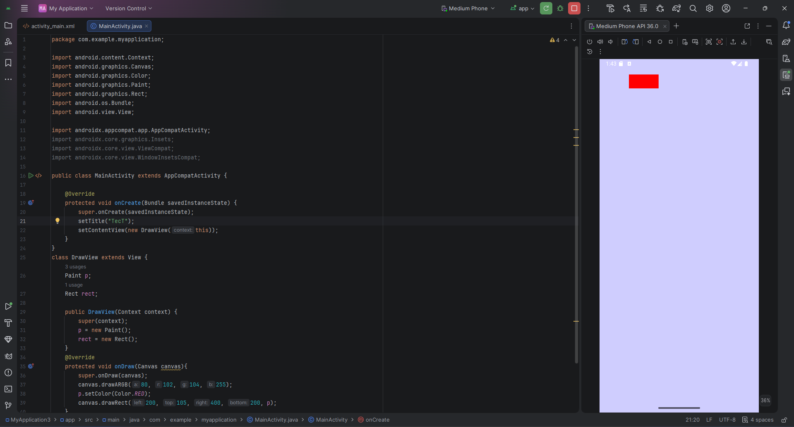
  
 Рисунок 10 — Добавление красного прямоугольника 

  
## 5. Выполнение индивидуального задания (Вариант 2): Создание фигур с помощью графических примитивов

### 1. Синий круг, занимающий половину площади экрана.

  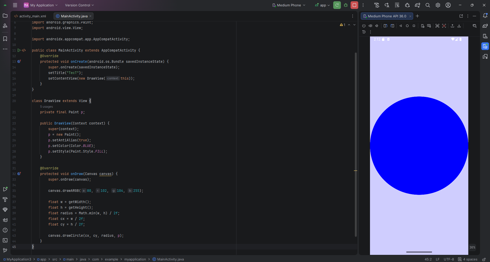
  
 Рисунок 11 — Отрисовывание синего круга 

  

### 2. Легковой автомобиль.

  
  
 Рисунок 12 — Отрисовывание легкового автомобиля 

  

## Вывод

В процессе выполнения практической работы были освоены основные этапы разработки приложений для Android:

* установка и настройка Android Studio;
* создание нового проекта с использованием шаблона;
* работа с эмулятором;
* изменение названия приложения;
* добавление графических примитивов (прямоугольник, круг, линия, треугольник, кривая) с помощью программного рисования на Canvas.

## Ответы на контрольные вопросы
### 1. Понятие виджета

Виджет — это графический элемент интерфейса, например кнопка, текстовое поле или изображение, который наследуется от класса View. Он используется для взаимодействия пользователя с приложением.

### 2. Графические примитивы

Графические примитивы — это базовые фигуры для рисования: точка, линия, прямоугольник, круг, эллипс, дуга. В Android они создаются с помощью классов Canvas и Paint.

### 3. Переопределение метода

Переопределение метода — это изменение реализации метода родительского класса в дочернем классе с помощью аннотации @Override. Оно позволяет задавать поведение, подходящее для конкретного класса.

### 4. Наследование

Наследование — это механизм ООП, при котором дочерний класс получает свойства и методы родительского класса. В Android это, например, используется при создании собственных виджетов на основе View.
