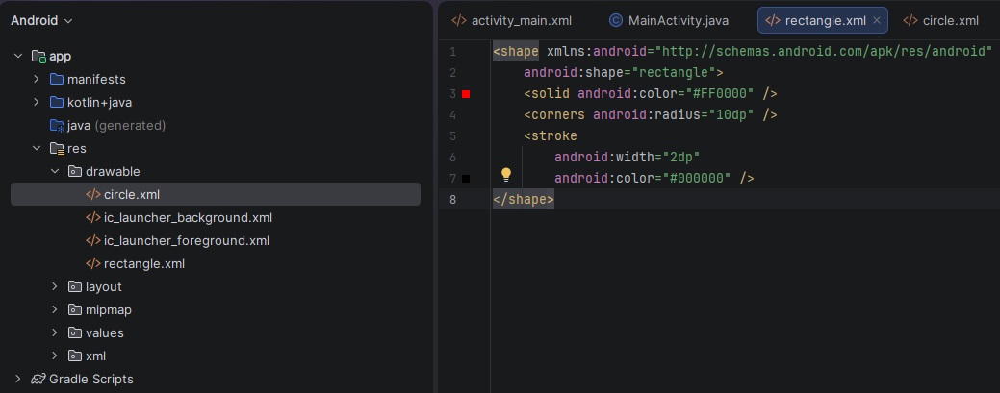
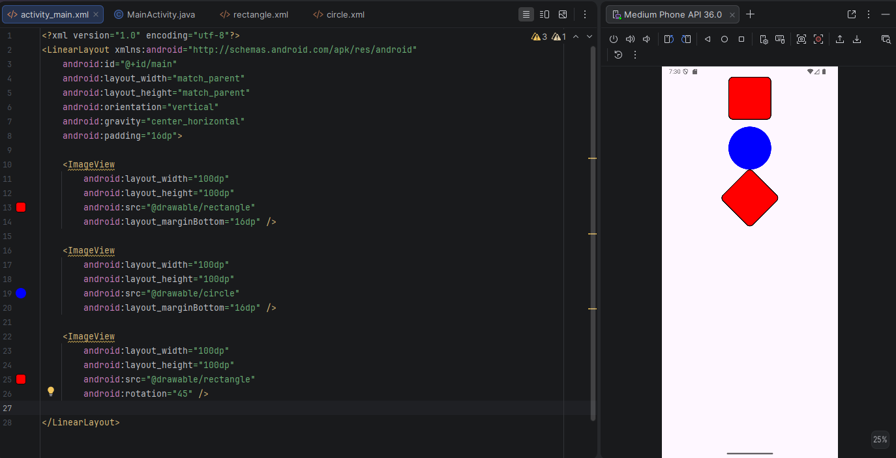
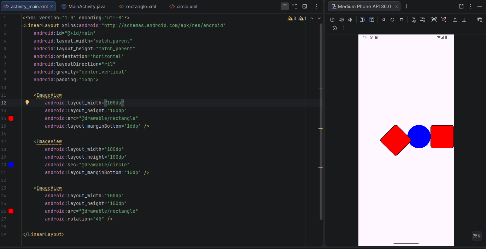
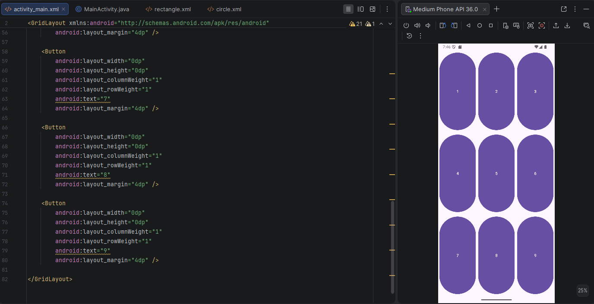
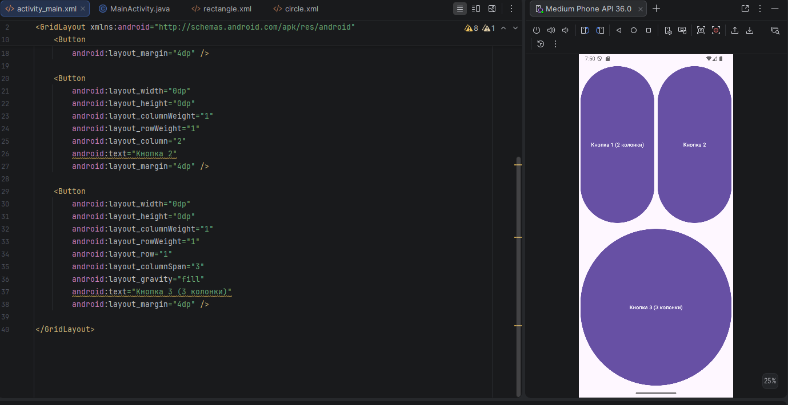
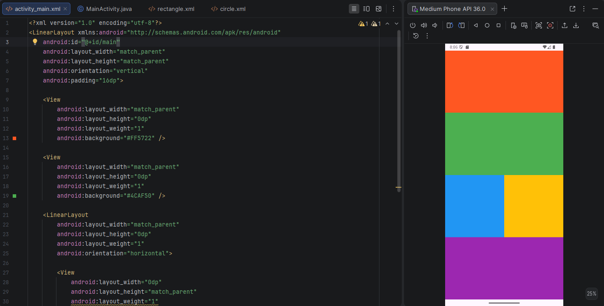
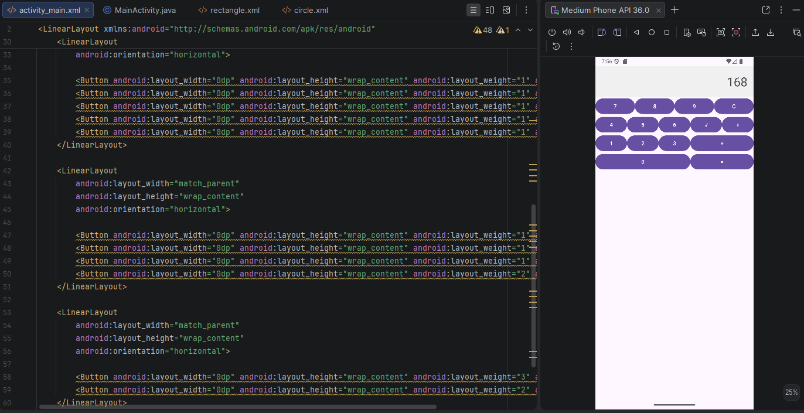

# Практическая работа №2: Основы разметки XML в Android
---
## Выполнил:
Быковников Тимофей Александрович 
Группа: ИНС-б-о-24-1
---
## Цель работы:

Изучить основы языка разметки XML для описания пользовательского интерфейса Android-приложений. Научиться использовать менеджеры размещения (контейнеры) LinearLayout и GridLayout для создания сложных экранов. Освоить основные атрибуты View и создание простых Drawable-ресурсов.

## Ход работы
### Задание 1. Создание проекта и подготовка ресурсов

Создан новый проект с шаблоном Empty Views Activity. Название проекта — Layoutlab. В папке drawable созданы файлы rectangle.xml и circle.xml:
  
<div align="center">
  
  <p> Рисунок 1 — Создание файлов rectangle.xml и circle.xml</p>
</div>

### Задание 2. Работа с LinearLayout

Открыли activity_main.xml и в нем создаем вертикальный LinearLayout с тремя ImageView, отображающими созданные drawable-ресурсы. Запущено приложение для проверки отображения фигур.

<div align="center">
  
  <p> Рисунок 2 — Отображение фигур из Drawable </p>
</div>
  
### 3. Изменение ориентации и выравнивания

В корневом LinearLayout заменён android:orientation="vertical" на android:orientation="horizontal". Фигуры выстроились в одну строку слева направо. Также добавим к LinearLayout атрибут android:layoutDirection="rtl".

<div align="center">
  
  <p> Рисунок 3 — Изменение ориентации на горизонтальную, gravity у родителя и порядка элементов </p>
</div>
  
### 4.  Работа с GridLayout

Создадим новый XML-файл разметки activity_grid.xml и воспользуемся GridLayout для создания таблицы кнопок 3x3.

<div align="center">
  
  <p> Рисунок 4 — Таблица кнопок 3x3 </p>
</div>
  
### 5. Выполнение индивидуального задания (Вариант 2): Создание фигур с помощью графических примитивов


<div align="center">
  
  <p> Рисунок 5 — Объединение кнопок в GridLayout </p>
</div>
  
## Задания для самостоятельного выполнения

### Часть 1. Базовое задание

Реализуйте размещение элементов, как на Рисунке 5 (Листинг 5) из исходного документа (вложенные LinearLayout). Используйте горизонтальные и вертикальные контейнеры. Нарисуйте на экране композицию, представленную на Рисунке 8 (пример с разноцветными прямоугольниками) из исходного документа. Используйте View с установленным android:background для цветных блоков.

<div align="center">
  
  <p> Рисунок 6 — Выполнение задания 1 </p>
</div>

### Часть 2. Задание по варианту

Используя менеджеры размещения LinearLayout и/или GridLayout, создайте указанную композицию из кнопок (или прямоугольников). Для вариантов 1-7 используйте соответствующие рисунки из исходного документа (Рисунки 9-15). Для вариантов 8-10 создайте буквы из кнопок.

<div align="center">
  
  <p> Рисунок 7 — Выполнение задания 2 </p>
</div>

## Вывод

Были изучены основы языка разметки XML для описания пользовательского интерфейса Android-приложений. Также научились использовать менеджеры размещения (контейнеры) LinearLayout и GridLayout для создания сложных экранов. И освоены основные атрибуты View и создание простых Drawable-ресурсов.

## Ответы на контрольные вопросы


### 1. Что такое XML? Для каких целей он используется в Android-разработке?
XML — это язык разметки, который позволяет структурированно описывать данные и интерфейс. В Android он используется прежде всего для описания экранов приложения, а также для ресурсов, меню, drawable-ресурсов, настроек и конфигураций. В разметке XML задают контейнеры, элементы интерфейса и их атрибуты, например размеры, текст, цвет, отступы. 


### 2. Что такое тег (элемент) в XML? Из каких частей он состоит?
Тег XML — это элемент разметки, который обычно имеет имя, атрибуты и содержимое.  
Например:

```xml
<Button
    android:layout_width="wrap_content"
    android:layout_height="wrap_content"
    android:text="Нажми меня" />
```

Здесь `Button` — имя тега, а `android:layout_width`, `android:layout_height`, `android:text` — его атрибуты. Тег может быть парным, с открывающим и закрывающим вариантом, либо самозакрывающимся. 


### 3. Какие менеджеры размещения (контейнеры) вы знаете? Кратко опишите каждый
Основные контейнеры в Android:
- `LinearLayout` — располагает элементы в одну линию: вертикально или горизонтально.
- `GridLayout` — размещает элементы в виде сетки из строк и столбцов.
- `ConstraintLayout` — гибкий контейнер для сложных интерфейсов, позволяет задавать связи между элементами.
- `RelativeLayout` — размещает элементы относительно друг друга или относительно родителя.
- `FrameLayout` — накладывает элементы друг на друга слоями.
- `TableLayout` — организует элементы в виде таблицы.


### 4. В чём разница между LinearLayout и GridLayout? В каких случаях какой контейнер удобнее использовать?
`LinearLayout` удобен, когда элементы нужно выстроить в один ряд по вертикали или горизонтали. `GridLayout` лучше использовать, когда нужен табличный вид, сетка или расположение с объединением ячеек.  
Если экран простой и линейный — выбирают `LinearLayout`; если нужно разместить кнопки как калькулятор, клавиатуру или шахматную сетку — удобнее `GridLayout`. 


### 5. Что такое match_parent и wrap_content? Приведите примеры использования
`match_parent` означает, что элемент занимает всё доступное пространство родителя. `wrap_content` означает, что размер элемента подстраивается под его содержимое.  
Пример: кнопка с `wrap_content` будет иметь размер по тексту, а блок с `match_parent` может растянуться на всю ширину экрана.


### 6. В чём разница между android:gravity и android:layout_gravity?
`android:gravity` выравнивает содержимое внутри самого элемента или внутри контейнера. `android:layout_gravity` определяет, как сам элемент располагается внутри родительского контейнера.  
Проще говоря: `gravity` — это выравнивание внутри, `layout_gravity` — выравнивание самого View относительно родителя.


### 7. Какие единицы измерения используются в Android? Для чего предназначены dp и sp?
В Android используются `px`, `dp`, `sp` и другие единицы.  
`dp` применяется для размеров элементов интерфейса, потому что он учитывает плотность экрана и помогает сохранить одинаковый визуальный размер на разных устройствах.  
`sp` используется для текста, потому что кроме плотности экрана учитывает ещё и системное масштабирование шрифта.


### 8. Как создать простую фигуру (прямоугольник, круг) с помощью XML-ресурса в папке drawable?
Для этого создают XML-файл в `res/drawable` с корневым тегом `<shape>`.  
Прямоугольник:

```xml
<shape xmlns:android="http://schemas.android.com/apk/res/android"
    android:shape="rectangle">
    <solid android:color="#FF0000" />
    rners android:radius="10dp" />
    <stroke
        android:width="2dp"
        android:color="#000000" />
</shape>
```

Круг:

```xml
<shape xmlns:android="http://schemas.android.com/apk/res/android"
    android:shape="oval">
    <solid android:color="#0000FF" />
    <size
        android:width="100dp"
        android:height="100dp" />
</shape>
```